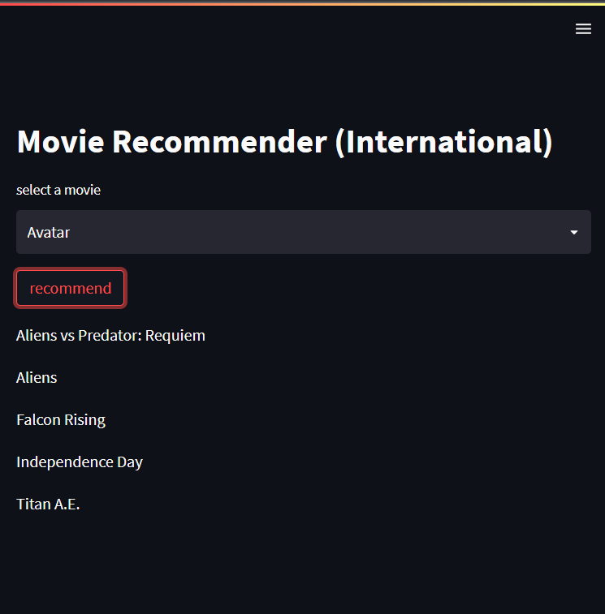

# Movie Recommender (International) - Streamlit App



This Streamlit app provides movie recommendations based on an international movie dataset. The app utilizes a movie similarity model to suggest similar movies to the one selected by the user.

## How It Works

The app uses a movie dataset and a similarity model to generate movie recommendations. Here's a summary of the key components:

1. **Data**: The movie dataset is stored as a Python dictionary and is loaded using `pickle`. The data includes movie titles and other relevant information.

2. **Similarity Model**: The similarity model computes the similarity between movies based on certain features, such as genre, actors, or plot. The similarity values are used to find the movies most similar to the user's selected movie.

3. **Recommendation Function**: The `recommend()` function takes the name of a movie as input and returns a list of recommended movies. It first finds the index of the selected movie in the dataset, then calculates the similarity distances between this movie and all others. The top five most similar movies are selected as recommendations.

4. **Streamlit App**: The Streamlit app displays a title "Movie Recommender (International)" and a dropdown menu to select a movie from the available options. Upon clicking the "recommend" button, the app calls the `recommend()` function with the selected movie name and displays the recommended movies below.

## Usage

1. Clone this repository:

```bash
git clone https://github.com/your-username/movie-recommender-app.git
cd movie-recommender-app
```

2. Install the required packages:

```bash
pip install streamlit pandas
```

3. Place the `movie_dict.pkl` and `similarity.pkl` files in the project directory. These files contain the preprocessed movie data and the similarity model.

4. Run the Streamlit app:

```bash
streamlit run app.py
```

5. The app will open in your default web browser. Select a movie from the dropdown list and click the "recommend" button to see the suggested movies.

## Note

This app is designed to provide movie recommendations based on a specific dataset and similarity model. Make sure to adjust the `movie_dict.pkl` and `similarity.pkl` files accordingly if you want to use a different dataset or similarity approach.

## License

This Movie Recommender app is released under the [MIT License](https://opensource.org/licenses/MIT).

---

**Note:** Customize this README.md file further as needed, including information about the dataset used, the creation of the similarity model, and any other relevant details about the app's functionality and deployment.
